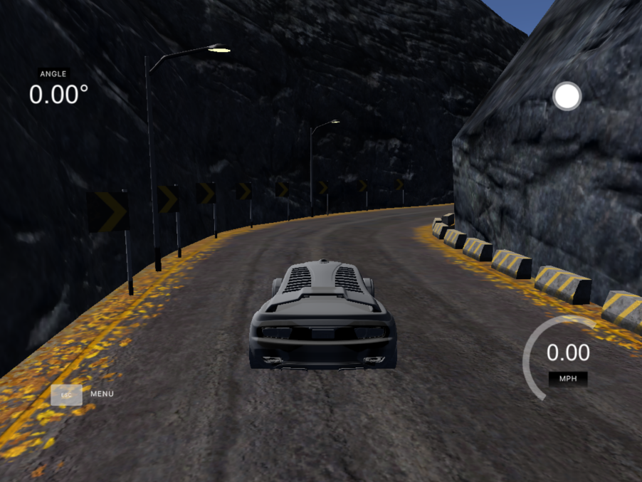

# Self Driving Car: Predicting Steering Wheel Angle

A convolutional neural network (CNN) approach is used to implement a self-driving car by predicting the steering wheel angle from input images taken by three front cameras located in the center, left and right of the car. The architecture of the model used was developed by NVIDIA for its autonomous navigation system called [DAVE-2](https://images.nvidia.com/content/tegra/automotive/images/2016/solutions/pdf/end-to-end-dl-using-px.pdf). The CNN is tested on the Udacity simulator.

For more information about the project check the [documentation](https://github.com/crisdanrodriguez/self_driving_car/blob/744b62edc634568150065124c0642c28ba1ba79d/Self-Driving%20Car,%20Predicting%20Steering%20Wheel%20Angle.pdf).

## Dataset
---
The dataset is excluded from the repository due to its size. Data for this task can be gathered with the Udacity [simulator](https://github.com/udacity/self-driving-car-sim) itself. Indeed, when the simulator is set to training mode, the car is controlled by the human though the keyboard, and frames and steering directions are stored to disk.

## Code Overview
---
The code is structured as follows:
- [`data_preprocessing.py`](data_preprocessing.py): contains all the necessary functions for data preprocessing.
- [`data_visualization.ipynb`](data_visualization.ipynb): visualizing data before and after data augmentation, and after image preprocessing.
- [`cnn_model.py`](cnn_model.py): creates the CNN model.
- [`main.py`](main.py): training and saving the model.
- [`autonomous_driving.py`](autonomous_driving.py): driving the car in autonomous mode.
- [`model.h5`](model.h5): contain a trained CNN model.

## Running Instructions
---
The requirements for this project can be installed by running:
```
pip install -r requirements.txt
```
*Note: It is recommended to use a virtualenv or conda for the installation of the requirements.*

Using the Udacity simulator, the autonomous_driving.py file, and the already trained model.h5, the car can be driven autonomously around the tracks by executing:
```
python autonomous_driving.py
```

## Model Performance
---
The model was tested on both tracks. On the first track, where the training data was collected, the model was able to run smoothly, however it is a bit unstable as it makes many small turns between left and right. On the other hand, in track 2 we can see that it has a better behavior and manages to run completely with a very good performance, so we can conclude that the model generalizes in a good way.

### Performance Video
[](https://youtu.be/dgYWUmMOcOk)


